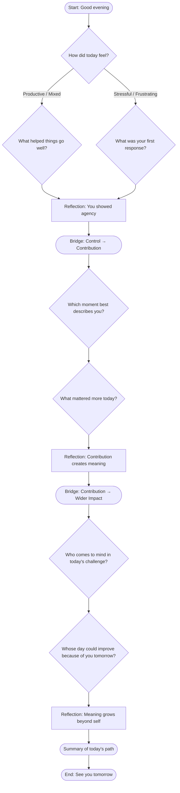

# Reflection Tree Diagram

```mermaid
flowchart TD

START([Start: Good evening]) --> Q1{How did today feel?}

Q1 -->|Productive / Mixed| Q2A{What helped things go well?}
Q1 -->|Stressful / Frustrating| Q2B{What was your first response?}

Q2A --> R1[Reflection: You showed agency]
Q2B --> R1

R1 --> B1([Bridge: Control → Contribution])

B1 --> Q3{Which moment best describes you?}

Q3 --> Q4{What mattered more today?}

Q4 --> R2[Reflection: Contribution creates meaning]

R2 --> B2([Bridge: Contribution → Wider Impact])

B2 --> Q5{Who comes to mind in today's challenge?}

Q5 --> Q6{Whose day could improve because of you tomorrow?}

Q6 --> R3[Reflection: Meaning grows beyond self]

R3 --> SUMMARY([Summary of today's path])

SUMMARY --> END([End: See you tomorrow])
```
